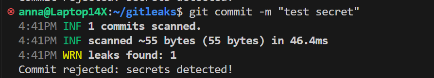

# Gitleaks Pre-commit Hook Demo

This repository demonstrates how to use **Gitleaks** to scan for secrets in your code before committing, utilizing a **pre-commit hook** and Docker. This guide provides step-by-step instructions for setting up and testing the Gitleaks pre-commit hook.

## Repository Structure

```
gitleaks-demo/
├── .git
├── .githooks/
│   └── pre-commit
└── test.txt
```

- `.githooks/pre-commit` — The pre-commit hook script that runs Gitleaks.
- `test.txt` — A test file used to verify secret detection.
- `.git` — The Git repository folder.

## 1. Install Gitleaks via Docker

1. Pull the latest Gitleaks Docker image:

```bash
docker pull zricethezav/gitleaks:latest
```

2. Test Gitleaks by running a scan on a directory:

```bash
HOST_PATH=~/gitleaks
docker run --rm -v $HOST_PATH:/repo zricethezav/gitleaks:latest detect --source /repo --no-banner
```

## 2. Configure the Pre-commit Hook

1. Create the hooks directory:

```bash
mkdir -p .githooks
```

2. Create the pre-commit hook script at `.githooks/pre-commit`:

```bash
#!/bin/sh

# Check if the hook is enabled
ENABLED=$(git config --bool hooks.gitleaks)
if [ "$ENABLED" != "true" ]; then
  echo "gitleaks pre-commit hook disabled. Skipping..."
  exit 0
fi

# Run Gitleaks using Docker
HOST_PATH=$(pwd)
docker run --rm -v $HOST_PATH:/repo zricethezav/gitleaks:latest detect --source /repo --no-banner
if [ $? -ne 0 ]; then
  echo "Commit rejected: secrets detected!"
  exit 1
fi
```

3. Make the hook script executable:

```bash
chmod +x .githooks/pre-commit
```

4. Configure Git to use the custom hooks directory and enable the Gitleaks hook:

```bash
git config core.hooksPath .githooks
git config hooks.gitleaks true
```

## 3. Test the Pre-commit Hook

1. Create a test file containing a secret:

```bash
echo "TELEGRAM_BOT_TOKEN=***********" > test.txt
git add test.txt
```

2. Attempt to commit the file:

```bash
git commit -m "test secret"
```

3. Expected output if secrets are detected:

```
4:41PM INF 1 commits scanned.
4:41PM INF scanned ~55 bytes (55 bytes) in 46.4ms
4:41PM WRN leaks found: 1
❌ Commit rejected: secrets detected!
```

The commit will be blocked if Gitleaks detects any secrets.

## 4. Temporarily Disable the Hook

To disable the Gitleaks pre-commit hook temporarily:

```bash
git config hooks.gitleaks false
```

---

This setup ensures that sensitive information, such as API keys or tokens, is not accidentally committed to your repository, enhancing the security of your codebase.
